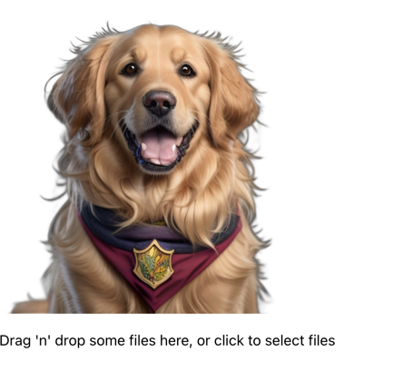

# Getting Started

This is a simple project to demonstrate how background image removal works with react and @imgly library

### `npm start`

After the project is running upload an image and wait for 20-30 second.
Also drag and drop is working. The react-dropzone library is used.

